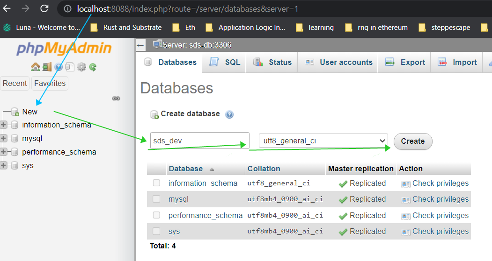
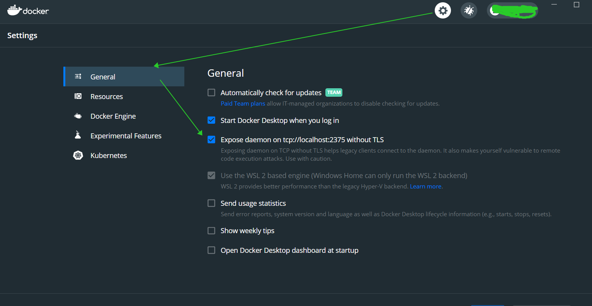

# SeascapeSDS Guide
> this is the golang package of the SeascapeSDS

***S**eascape **S**oftware **D**evelopment **S**ervice*
is the right toolbox to build feature rich applications on a blockchain.

---
Whenever you write a dapp, you also write the additional tools around the smartcontracts.

* You write an unnecessary software that frequently reads the blockchain to update your backend.
* You write an unnecessary tool that signs the transaction to change the state of smartcontract.
* You need to write calculations for metadata. Such as representing token in fiat currency, or calculating APY/APR for defi project as we faced in during mini-game development.

These tools are not exactly blockchain related. Most of the smartcontract developers doesn't required to write them. Its the burden of the backend developers.

You would be amazed how many backend developers fail during the development of these basic tools. Surprisingly it requires a good knowledge of the blockchain's API and internal work. Yet, the learning curve is quite long and painful.

Knowing these facts, there are popping a lot of startups that provides these tools for a fee. How many messages I am getting every day on my professional email, or personal email from outsourcing companies that tries to get overpriced money for such tools.

#### Let me give you more examples!


What if your application is cross-chain, let's say your NFT or Token is cross-chain. 

Or you want to utilize additional features in your smartcontracts, maybe oracles or schedulers. In that case each of them has their own cryptocurrency. You have to manage multi-currency for your single dapp.

You still wonder, why there is no big "play2earn" games and dapps?

> It comes from the expertise of the game developers working in the crypto space since 2018.

---

# Enter SeascapeSDS
Consider SeascapeSDS as the list of three linked tools.
* ***cli*** &ndash; for smartcontract developer
* ***sds*** &ndash; for processing smartcontract
* ***sdk*** &ndash; for backend developer

The smartcontract developer deploys the smartcontract with ***cli***, and all the tools to read data, to write the data appear on ***sds***. Then the backend developer who wants to read the data or send the data uses ***sdk***.

Since SeascapeSDS (all three are open-source), if you don't have the feature that you want, then you can create it on your own or ask the community to build it for you.

The blockchain is a complex an advanced technology. To create the big innovations, working as a single team is not enough. We should work together and share the experiences (which is SeascapeSDS) to push the innovations.

Right, let the cryptocurrency of each project "go to the moon" because of its popularity and its users, not because of the underlying technology.

---
# Installation

*Prerequirements*

## Building the package

### Go
The SDS core is written in Go programming language, therefore we need Go to be installed on the machine. 
Visit the [go](https://go.dev/) official website for installation instructions. 

Once you have go installed, you can import SDS into your go project as:

```sh
go get github.com/Seascape-Foundation/sds-service-lib
```

###ZeroMQ

Internally, SDS relies on [ZeroMQ](https://zeromq.org/) C (programming language) library. SDS uses [pebbe/zmq4](https://github.com/pebbe/zmq4) &ndash; a go wrapper around C library.

> :bulb: **Detailed instructions**
> [pebbe/zmq4/requirements](https://github.com/pebbe/zmq4#requirements)

#### Enable CGO:

In Centos8:

```bash
export CGO_ENABLED=1
```

#### Go with CGO enabling depends on GCC.

In Centos8:

```bash
yum install dnf && dnf group install "Development Tools"
```

The successfull installation should have `gcc` to be available on the Terminal.


#### Install Zeromq and its dependencies

In Centos8

```bash
yum install epel-release && yum install zeromq-devel
```

*The official Centos repository doesn't include Zeromq, therefore, we first install `epel` repository.*


---
# Example

Create a new folder for the project:

```bash
mkdir hello-sds
cd hello-sds
go init github.com/example/hello-sds
```

Then install the SDS package:
```bash
go get github.com/Seascape-Foundation/sds-service-lib
```

>Let's assume that the smartcontract developer deployed the smartcontract on a blockchain. He did it using SDS CLI. Now our smartcontract is registered on SeascapeSDS.

>For example let's work with ScapeNFT. Its registered on the SeascapeSDS as:


>```javascript
> {
> 	organization: "seascape"
>	project:      "core"
>	network_ids:  ["1", "56", "1284"]
>	group:        "nft"
>	name:         "ScapeNFT"
>}
> ```


With the gosds package installed, let's create the `.env` file with the authentication parameters.

> Installation process of gosds and its setup requirements will be added later.

Here is the sample code that tracks all NFT events from `Seascape` organization in all networks.

```go
package main

import (
	"fmt"
	"log"

	"github.com/Seascape-Foundation/sds-service-lib/service/configuration/env"
	"github.com/Seascape-Foundation/sds-service-lib/service/communication/message"
	"github.com/Seascape-Foundation/sds-service-lib/common/topic"
	"github.com/Seascape-Foundation/sds-service-lib/sdk"
)

func main() {
	filter := topic.TopicFilter{
		Organizations: []string{"seascape"},
		Groups:        []string{"nft"},
	}

	subscriber, _ := sdk.NewSubscriber(&filter, true)
	subscriber.Start()

	for {
		reply := <-subscriber.Channel

		if reply.Status == message.FAIL {
			fmt.Fatalf("received an error %s", reply.Message)
			break
		}


		for _, event := range reply.Parameters.Logs {
			event_name := event.Name
			event_parameters := event.Parameters

			fmt.Printf("Event Name: '%s'\n", event_name)
			fmt.Printf("Parameters: %v\n", event_parameters)
			fmt.Printf("Network: %s\n", event.SmartcontractKey.NetworkId)
			fmt.Printf("Timestamp %d\n", event.BlockHeader.Timestamp)

			// Do something with the event logs
		}
	}
}

```

That's all! No need to know what is the smartcontract address, to keep the ABI interface (If you know what are these terms mean).

SeascapeSDS will care about the network issues, about smartcontract ABI and its address.

#### Now let's discuss about about the code.

Very important thing there is the topic `filter` variable.
In the topic, we listed the smartcontract name: `ScapeNFT`, but we didn't list the network ids (remember that the NFT is deployed on `Ethereum`, `BNB Chain` and `Moonriver`).

By omitting network ids, Scape NFT on any network will be received by the backend.

If you want for example to track ScapeNFTs on BNB Chain then change the topic filter to:

```go
filter := topic.TopicFilter{
    Organizations:  []string{"seascape"},
    Projects:       []string{"core"},
    Smartcontracts: []string{"ScapeNFT"},
    NetworkIds:     []string{"1"},
    Methods:        []string{"transfer"},
}
```

* If you want to track any transaction, then remove the Methods.
* If you want to track any nft in the seascape ecosystem, then 1. delete the `Smartcontracts`, `Projects`, add the `Groups: []string{"nft"}`.

Once we got the transactions, what about the parameters of the transactions? In the example above we listed three arguments as:

```go
nft_id := tx.Args["_nftId"]
from := tx.Args["_from"]
to := tx.Args["_to"]
```

The names of the arguments are identical how they are written in the source code. 

On the roadmap, we have a plan want to generate a documentation by AI. AI will parse the smartcontract interface, and will set the basic use cases with `copy-paste` code. Write, the less developer writes, the better it is.

> :bulb: **More examples**
> Coming soon.

---

# Source code

If you want to run SDS in your local computer, then we need two external applications: Database and Vault.

> :bulb: **Tip**
> You can skip the Vault if you run the application with `--plain` argument.

There are two options how to install them: Install manually or by docker.

## Docker

The docker package also comes with the UI for vault and Database.

### Docker and Docker Compose
For local production you would need `docker` and `docker-compose`.
Installation of [Docker Desktop](https://www.docker.com/products/docker-desktop/) will install `docker-compose` file as well.

---

### Install images
> :memo: **For Linux**
> Before you install images, you should create `_db/mysql` and `_db/mysql_logs` directories.

To install database image only:

```shel
docker compose up -d sds-db
```

or if you want to install both database and vault along with the UI.
```shell
docker compose up -d
```

 * database web UI: http://localhost:8088/
  username: `root`
  password: `tiger`
 * vault web UI: http://localhost:8200/ui/
  *Login into vault web UI will require key part and root token. Both are stored in `./_vault/tokens/root.json`. The key part=`"keys_base64"`. The root token=`"root_token"`*


## Manually

> Follow the Mysql database and Hashicorp Vault websites to install on your machine.

## Setup Database
Once we have Database, we need to setup for SDS. This example assumes that you've using Database via Docker.

### Create a new database.

In terminal:

```bash
docker exec -it sds-db bash
mysql -u root -p
```
For password type `tiger`.
In the Mysql create the SDS database:

```sql
CREATE DATABASE sds_dev `
CHARACTER SET utf8 COLLATE utf8_general_ci;
```

Then exit from mysql and from container by typing `exit` twice.

On UI:


1 Go to http://localhost:8080/
2 Login with *username* `root` and *password* `tiger`.
3 On the panel, click the *New* button to create the database.
4 Name of the database. For example: *sds_dev*
5 Encoding format should be **utf8_general_ci**.

### Install migration tool
We use [*goose*](https://github.com/pressly/goose).
Follow the [Installation](https://pressly.github.io/goose/installation/) page to setup on your machine.

> In our example we store the goose binary in `/_db/bin/` directory.*

### Migrate tables
In the `sds` root directory, run the following:

```powershell
./_db/bin/goose `
-dir ./_db/migrations `
mysql "root:tiger@/sds_dev" `
up
```
The `root` is the username, `tiger` is the password.
`sds_dev` is the database name that we created during **Create a new database** step.


> :memo: **Creating a new migration**
> ```powershell
> ./_db/bin/goose `
> -dir ./_db/migrations `
> mysql "root:tiger@/sds_dev" `
> create <action_name> sql
> ```

## Minimum environment
Create `.env` in the root from where you call the binary.

```env
SDS_DATABASE_NAME=sds_dev
```

## Build binary

```bash
go build -o ./bin/sds
```

On Windows

```powershell
go build -o ./bin/sds.exe
```

## Run SDS

```bash
./bin/sds --plain ./.env
```

## Next

Either set the Security or Install SDS Gateway. Or setup the [configurations](#sds-configuration).

---
# Security

## Vault
For setting up the Vault, visit the page:
[Vault setup](./VAULT.md).

---

# SeascapeSDS Core
This go module contains the core features
and SDK along together.

This repository isn't enough to run the SeascapeSDS in your machine. 

The following set ups are necessary for running on your machine:

* [Vault](https://vaultproject.io/) for keeping credentials
* [Mysql Database](https://mysql.com/) 
* [sds-ts](https://github.com/Seascape-Foundation/sds-service-lib-ts/) keeps the other core services that are written in Typescript.
* .env with the SeascapeSDS Service ports, its configuration, vault access and database parameters.

# SDS Configuration

We can set the following environment variables

| Name                                | Default | Description |
|-------------------------------------|---------|-------------|
| `SDS_BLOCKCHAIN_NETWORKS` |         | See [Network](#network) section |
| `CORE_PORT` | *4001* | The SDS is available for SDS Gateway on this port |
| `SDS_DATABASE_NAME` | *seascape_sds* | The database name |
| `SDS_DATABASE_PORT` | *3306* | The database port |
| `SDS_DATABASE_HOST` | *localhost* | The database host |
| `SDS_DATABASE_TIMEOUT` | *10* | The request timeout seconds. If database doesn't responde within the timeout, then SDS will terminate or return an error |
| `SDS_REQUEST_TIMEOUT` | *30* | The request timeout in Seconds. Any request from one thread or process to another (whether its internal or remote) handles `SDS_REQUEST_TIMEOUT` seconds. If the remote service doesn't respond within the timeout, then SDS will reconnect. **It goes along with with `SDS_REQUEST_ATTEMPT`** |
| `SDS_REQUEST_ATTEMPT` | *5* | Amount of reconnects that SDS is trying to do. If the remote thread or process doesn't respond within `SDS_REQUEST_TIMEOUT` seconds, then SDS will make `SDS_REQUEST_ATTEMPT` attempts. If the remote thread or process doesn't responde with all attempts, then SDS will return an error. |
| `SDS_IMX_REQUEST_PER_SECOND` | *20* | How many requests SDS can do to the remote Imx provider. This parameter sets the limit that is managed by SDS. The more smartcontracts are registered on `imx` network, the slower the fetch speed. |


## Network

```env
SDS_BLOCKCHAIN_NETWORKS=[{"id":"56","providers":[{"url":"https://rpc.ankr.com/bsc","length": 32}],"type":"evm"}]
```

Add any `EVM` based networks or `ImmutableX` based networks in the environment variable.
**The value is the JSON array with Network objects in the single line**.

Here is the format of the JSON value:
```json
[
	{
		"id":"56",
		"providers":[
			{
				"url":"https://rpc.ankr.com/bsc",
				"length": 32
			},
			{
				"url": "https://binance.nodereal.io",
				"length": 32
			}
		],
		"type": "evm"
	}
]
```

Description of the parameters

* `"id"` &ndash; **string** Network ID. For EVM based networks its identical to the Chain ID.
* `"type"` &ndash; **string** Type of Blockchain. Supported types are: *`evm`* and *`imx`*.
* `"providers"` &ndash; **Array** of Providers. 

You can set multiple providers for each network. SDS is smart enough to use all of the providers for the blockchain requests.

Description of the Provider parameters:
* `"url"` &ndash; **string** HTTP path to the remote blockchain node RPC.
* `"length"` &ndash; **Number** Amount of blocks that SDS could fetch from the remote RPC.

Once you set the SDS, stop binary, and re-run to enable the new networks.

# Testing

> :warning: **Docker**
> It requires docker and docker host exposing.
> 
> For Windows we need to expose the deamon
> 
> * Settings
> * General
> * Checkmark the *Expose Deamon*
> * Restart the docker engine
> 
> Then you need to set the `DOCKER_HOST`.
> On powershell
>
> ```powershell
>  $env:DOCKER_HOST="tcp://localhost:2375"
> ```

Run recursively
```bash
go test ./...
```