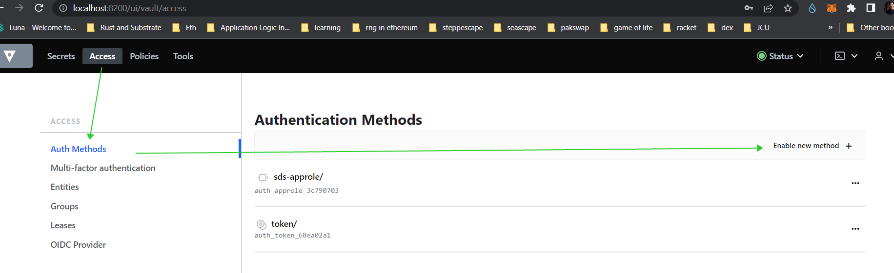
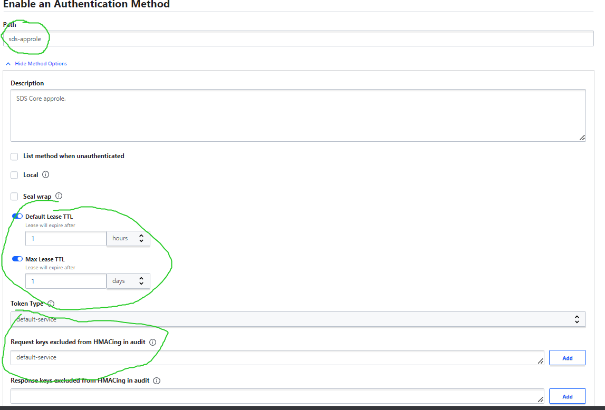
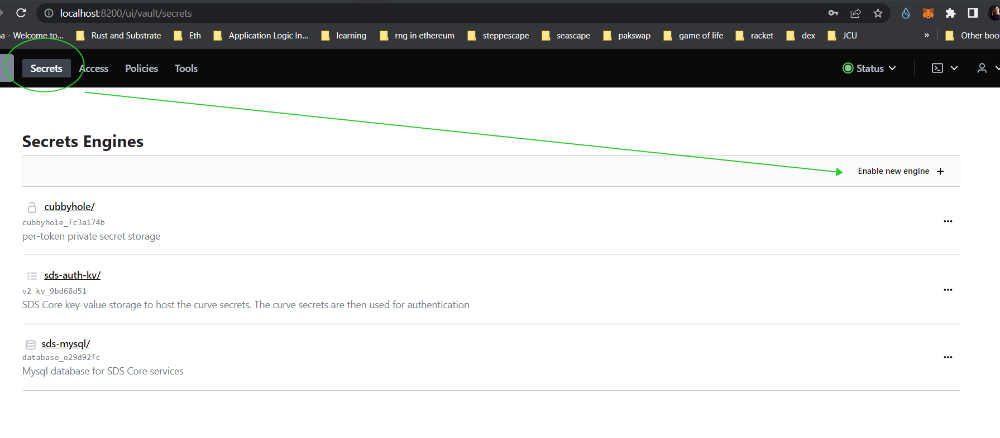
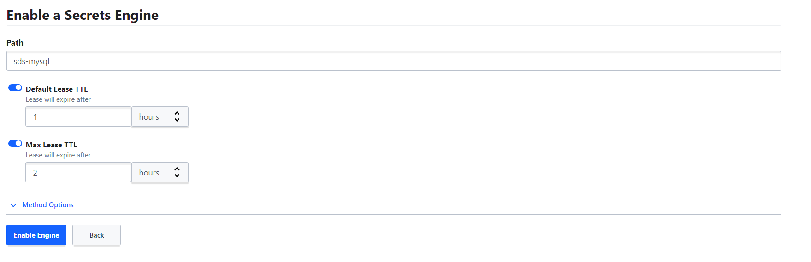
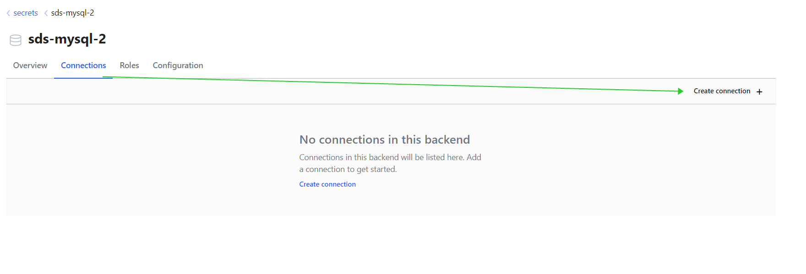
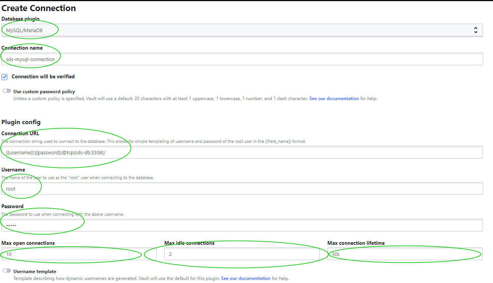
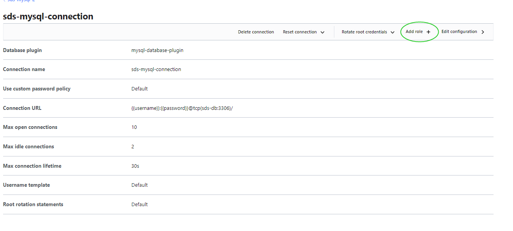
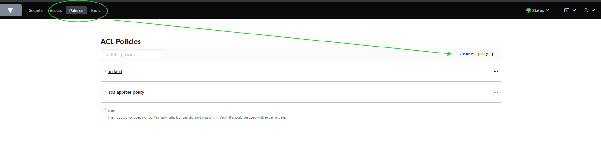

# Vault

SeascapeSDS uses [vault](https://vaultproject.io/) from *Hashicorp*.

This document explains the instructions on how to setup Vault using UI.

By default, if you setted up the Vault using `docker-compose.yml`, then its available on [localhost:8200/ui/](http://localhost:8200/ui/)

---

## Approle
First we need to create a new `approle`.

1.In the web ui, go to the `access`:
.

In the `Authentication Methods`, click on `Enable New Methods`.

---

2.Select the `approle` type for the authentication method:
.

Click on `Next`.

---

3.Configure the approle:
.

Usually we I set the path as `sds-approle`.
Set the approle rotation parameters:
`Default Lease TTL` and `Max Lease TTL`.

The token type is `default-service`. Then include the token from HMAcing audit.

Finally, click on `Enable Method`.
Then go to the `access`.

> We can create the approle and update it on the UI.
> But first we need to setup three more things on UI: 1. *Setup Database credentials.* 2. *Setup key-value secret storage* 3. *Setup a policy for approle to work with the secrets*.
---

# Secrets
We need to setup the database credentials and key-value storage.
While database credentials are self explaining, the key-value storage is used to store the authentication curve keys.

## Configure database credentials
Create a new secret engine:


On the next page, select `Databases` as the engine type.

Then, we set the path name, rotation parameters:


I usually set the path to `sds-mysql`.
Then default lease to `1h` and max ttl to `2h`.

---

### Database connection
The successfully enabled database engine will show the page with the `Connection`.

Create the connection:


---

Let's set the database connection parameters:


The database plugin is: `MySQL/MariaDB`.

The name of the `Connection`:
`sds-mysql-connection`.

The connection url:
`{{username}}:{{password}}@tcp(sds-db:3306)/`
Note that `sds:3306` is set because vault connects to the database via docker.

Max open connections: *10*.
Max idle connections: *2*.
Max connection lifetime: *30s*.

Username: *`root`*.
Password: *`tiger`*.

Create the database connection. **Enable without rotating**. Without rotating due to the local setup.

## Database role
After successul setup of the connection,
It will show up connection parameters:



Click on the `Add role`.

The parameters of the role:
Connection name: `sds-mysql-connection` *Connected automatically*.
Role name: `sds-mysql-role`.
Type of role: `dynamic`.
Credentials Time-to-Live: `1 hour`.
Credentials maximum Time-to-Live: `2 hour`.
Create Statement: `CREATE USER '{{name}}'@'%' IDENTIFIED BY '{{password}}';  GRANT SELECT ON *.* TO '{{name}}'@'%';`

We created the database secret engine.
We set the dynamic role that creates the temporary username and password for the app.
And we set the database connection to the database.

---

## Key-Value Secret
Go to the `secrets`. Click on `Enable new engine`.

As the type of the engine, select `kv`.
Type the `path` to `sds-auth-kv`.

Viola!

---

# Policy
In order to combine authenticator `approle` to the secret engines, we need to create a policy with the permissions.

Go to the `policies` page:


Click on `Create ACL Policy`.

Set the name of the policy as `sds-approle-policy`.
As the policy itself copy and paste the one stored on `./_vault/config/sds-approle-policy.hcl`:

```hcl
path "auth/sds-approle/login" {
  capabilities = ["create", "read"]
}

path "sds-mysql/creds/sds-mysql-role" {
  capabilities = ["read", "create", "list", "update", "delete"]
}

path "sds-auth-kv/curves/" {
  capabilities = ["read", "create", "list", "update", "delete"]
}
```
Create the Policy.
If you set the path for secrets and approle, then set the correct ones.

---

# RoleID and SecretID in Vault CLI
We set the secrets, policy and the approle. However for application to use approle, we need to obtain `role_id` and `secret_id`.

The management of the approle happens via Vault CLI.
> Vault UI doesn't support management of the approle.

Enter into the vault container:

```powershell
docker exec -it sds-vault sh
```

> It requires `VAULT_ADDR`, otherwise vault cli will throw error about SSL missing.
> It requires `VAULT_TOKEN` environment variables. They are set in `docker-compose.yml` to the default ones that I already created.
> Replace them with the token parameters that you created.

---
### RoleID

```sh
vault write auth/sds-approle/role/sds-core 
policies=sds-approle-policy role_id=sds_core
```

We need to set the approle's path that we named during its creation.
As the policy set the name that we created during the approle creation.

Finally, we set the `role_id` to any name. I set it as `sds_core`.

### SecretID

```sh
vault write -f auth/sds-approle/role/sds-core/secret-id
```

Write to the sds-approle/role/sds-core
a new secret id.
The console will show the newly generated secret id.

For example:

```bash
Key                   Value
---                   -----
secret_id             908dbfad-8fee-4119-5a31-d43e57f656e6
secret_id_accessor    39c46801-39f9-f79f-3b6a-6f610f23a3b8
secret_id_num_uses    0
secret_id_ttl         0s
```

Copy the `secret_id`.

---

# Setup environment variables

Our SDS should now the Vault parameters.
Therefore in the environment variable set the followings:

```sh
# Vault parameters
SDS_VAULT_APPROLE_ROLE_ID=sds_core
SDS_VAULT_APPROLE_SECRET_ID=908dbfad-8fee-4119-5a31-d43e57f656e6
SDS_VAULT_APPROLE_MOUNT_PATH=sds-approle
SDS_VAULT_PATH=sds-auth-kv
SDS_VAULT_DATABASE_PATH=sds-mysql/creds/sds-mysql-role
```
